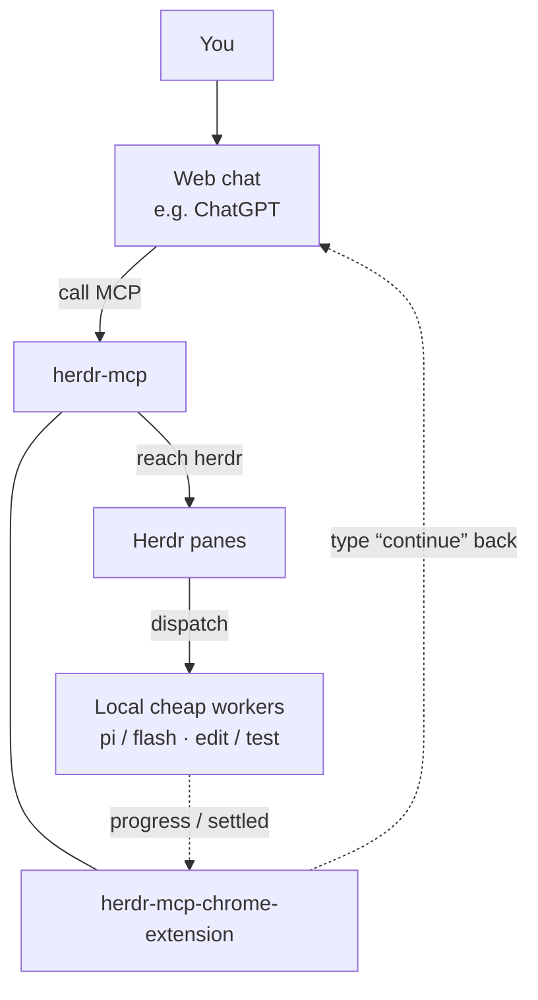

# herdr-mcp

ウェブ版 SOTA モデルが本機の [herdr](https://herdr.dev) に到達し、プロジェクトへ入り、ローカル agent を調度して開発を手伝うための MCP。

**言語（herdr と同じ）:** [English](README.md)（GitHub 既定）· [简体中文](README.zh.md) · [日本語](README.ja.md)。  
CLI / ブラウザ拡張: 初回インストールはシステム言語（`en` / `zh` / `ja`）を検出、不明なら英語。変更: `herdr-mcp lang`、または拡張の Options → Language。

## アーキテクチャ（あなた ↔ ウェブ ↔ MCP ↔ herdr、拡張が逆方向チャネル）

上から下へ: あなた → ウェブ会話 →（herdr-mcp と chrome-extension **同列**）→ Herdr panes → ローカル agents。  
Agents の進捗 / settled が拡張へ届き、拡張がウェブ会話へ「続行」を打ち返す。詳細: [docs/extension-wake.md](docs/extension-wake.md)（中国語。英語 README の概要も参照）。

**オーケストレーション方針（ウェブが計画、本機は安価）:** 計画はウェブモデル側。`herdr_fs_*` / `herdr_exec` を優先（ローカル agent API 不要）。agent が必要なら安い/高速 worker に直接 `herdr_prompt` — 本機 Claude/OMP/main を中間マネージャにしない。`inspect`/`since` は既定で Claude/OMP/Codex をソフト非表示（pi/cline/opencode/anti + droid/grok）。既知 pane への prompt は可。`HERDR_MCP_AGENT_ALLOW=*` で全表示。



## 対応 OS と起動

[herdr](https://herdr.dev) と同じく **macOS / Linux / Windows**（Node.js 20+）。インストールディレクトリは走査せず、API socket（既定 `~/.config/herdr/herdr.sock`、`HERDR_SOCKET_PATH` で上書き）と PATH 上の `herdr api schema` を使う。

前景起動で十分:

```bash
export HERDR_MCP_TOKEN="$(openssl rand -hex 16)"
export HERDR_MCP_PORT=8772
# 公開 Connector 用（/mcp サフィックスなし）:
# export HERDR_MCP_BASE_URL=https://xxxx.trycloudflare.com
node dist/server.js
```

ログイン項目 / systemd / Task Scheduler などは各自。macOS では任意で `bin/herdr-mcp` を symlink して `status` / `logs` に使える。本体は常に上記 Node プロセス。

## インストール（ゼロから動くまで）

### 0. 前提

- [herdr](https://herdr.dev) がインストール済みかつ起動中
- Node.js 20+（`node -v`）
- ChatGPT 向け: `cloudflared` による公開 HTTPS（[Quick Tunnel](https://developers.cloudflare.com/cloudflare-one/connections/connect-networks/do-more-with-tunnels/trycloudflare/)）または自前ドメイン

### 1. 取得とビルド

```bash
git clone https://github.com/whshang/herdr-mcp.git
cd herdr-mcp
npm install
npx tsc
mkdir -p ~/.config/herdr-mcp
```

### 2. ローカル MCP 起動

```bash
export HERDR_MCP_TOKEN="$(openssl rand -hex 16)"
echo "token=$HERDR_MCP_TOKEN"
node dist/server.js
```

### 3. ChatGPT 接続（推奨: 無料 Cloudflare）

別ターミナル:

```bash
cloudflared tunnel --url http://127.0.0.1:8772
```

その origin（**`/mcp` なし**）で MCP を再起動:

```bash
export HERDR_MCP_BASE_URL=https://xxxx.trycloudflare.com
export HERDR_MCP_TOKEN=...
node dist/server.js
```

#### ChatGPT **Web** で Connector を追加（チャット UI / デスクトップからは不可）

1. [Plugins 設定](https://chatgpt.com/#settings/Plugins) で Developer mode をオン
2. [Create connector](https://chatgpt.com/plugins#settings/Connectors?create-connector=true)
3. MCP URL は `https://xxxx.trycloudflare.com/mcp`
4. ログインしてリダイレクトを待つ（API key / token は貼らない）
5. 接続後は**新しい**チャットを開始

トラブル時は `HERDR_MCP_BASE_URL` と tunnel 稼働、`herdr-mcp status` を確認。詳細: [docs/chatgpt-connector.md](docs/chatgpt-connector.md)。

### Cursor（任意・同一マシン）

`~/.cursor/mcp.json` — ローカルのみ:

```json
{
  "mcpServers": {
    "herdr-mcp-local": {
      "url": "http://127.0.0.1:8772/mcp",
      "headers": {
        "Authorization": "Bearer <paste: herdr-mcp token>"
      }
    }
  }
}
```

## エンドポイント

| 用途 | URL |
|---|---|
| ローカル MCP | `http://127.0.0.1:8772/mcp` |
| 公開 MCP | `{HERDR_MCP_BASE_URL}/mcp` |
| ブラウザ拡張 push | `http://127.0.0.1:8772/push/events` |

Connector 認証は **OAuth (DCR)**。静的 Bearer はローカル curl / Cursor 用（`herdr-mcp token`）。

## CLI

```bash
herdr-mcp              # メニュー
herdr-mcp status
herdr-mcp connector
herdr-mcp start | stop | restart
herdr-mcp logs [-f]
herdr-mcp token | url
herdr-mcp lang [en|zh|ja]
```

コード変更後: `npx tsc && herdr-mcp restart`。

## 既定ツール（なぜこの 17）

herdr のネイティブ面は大きな Unix-socket API（`herdr api schema`）。herdr-mcp は全メソッドを MCP ツールに再包装しない。代わりに:

| 層 | MCP ツール | herdr との関係 |
|---|---|---|
| Passthrough | `herdr_methods`, `herdr_call` | ネイティブ socket API への薄いゲート |
| リモート編成 | `herdr_inspect`, `herdr_since`, `herdr_prompt` | ウェブ向け小さなヘルパ |
| リモート workstation | `herdr_fs_*`, `herdr_exec*` , `herdr_git` | オフマシンクライアント向けのディスク/シェル面 |

詳細なツール表は [README.md](README.md)（英語）を参照。

## ブラウザ拡張

フォルダ: `extension/`（MV3）。`chrome://extensions` で unpacked 読み込み。

1. **進捗ナッジ** — 会話を herdr **workspace** にバインド（agent なしの端末 pane も含む）。既定チェック間隔 **2 分**、変化なし時のフォールバック **20 分**。
2. **JSON → MCP** — DeepSeek / z.ai などで `{"tool":...}` → ローカル `/mcp`

UI 言語: en / 简体中文 / 日本語。詳細: [docs/extension.md](docs/extension.md)。

## ドキュメント

| Doc | 内容 |
|---|---|
| [docs/extension.md](docs/extension.md) | 拡張の二本線（中国語） |
| [docs/architecture.md](docs/architecture.md) | herdr vs MCP（中国語） |
| [docs/chatgpt-connector.md](docs/chatgpt-connector.md) | ChatGPT OAuth（中国語） |
| [docs/extension-wake.md](docs/extension-wake.md) | 進捗ナッジ（中国語） |
| [README.md](README.md) | 英語（GitHub 既定・ツール表フル） |

## Ops

```bash
npx tsc
# node dist/server.js を動かしているプロセスを再起動
```

Sessions: `~/.config/herdr-mcp/sessions/`。
