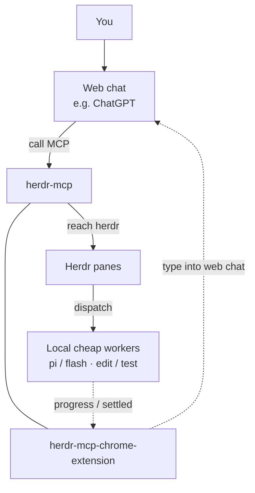

# herdr-mcp

ウェブ LLM（とくに ChatGPT Connector）が本機の [Herdr](https://herdr.dev) を駆動するための MCP HTTP ゲートウェイ。ペイン / agent の確認、git 管理下のプロジェクト編集、シェル実行、安価なローカル worker への投入。Chrome 拡張が進捗 / 続行を、紐づけたウェブ会話へ打ち返す。

**Docs:** https://whshang.github.io/herdr-mcp/ · **Source:** https://github.com/whshang/herdr-mcp

[Herdr](https://herdr.dev) はコーディング agent 向けの端末マルチプレクサ。このリポジトリはソケットもディスクも見えない**遠隔**クライアントの入口。Herdr の約 90 個のネイティブメソッドを MCP ツールに再包装しない。

**しないこと:** Herdr の代替。DeepSeek に偽の OAuth connector を付ける。拡張をローカル以外へ出す（拡張は `127.0.0.1` のみ）。

**言語（herdr と同じ）:** [English](README.md)（GitHub 既定）· [简体中文](README.zh.md) · [日本語](README.ja.md)。  
CLI / ブラウザ拡張: 初回インストールはシステム言語（`en` / `zh` / `ja`）、不明なら英語。変更: `herdr-mcp lang`、または拡張の Options → Language。

## アーキテクチャ（あなた ↔ ウェブ ↔ MCP ↔ herdr、拡張が逆方向チャネル）

上から下へ: あなた → ウェブ会話 →（herdr-mcp と chrome-extension **同列**）→ Herdr panes → ローカル agents。  
Agents の進捗 / settled が拡張へ届き、拡張がウェブ会話へ書き込む。詳細: [docs/i18n/en/extension-wake.md](docs/i18n/en/extension-wake.md)（英語）。

**オーケストレーション（ウェブが計画、本機は安価）:**

- `herdr_fs_*` / `herdr_git` / `herdr_exec` を優先（ローカル agent API 不要）。
- 推論が必要なら Herdr-native の安い/高速 worker（`pi` / `flash` / `cline` / `opencode` / `anti`）または監査（`droid` / `grok`）へ直接 `herdr_prompt`。本機 Claude/OMP/main を中間マネージャにしない。
- Pi/Herdr worker が使えない場合は、実測済みの `dsh --profile headless "task"` を CLI fallback にできる。ただし非自明な coding task は `herdr_exec_start` の長時間 session で実行し、timeout 後は再送前に Git/test の実結果を確認する。`dsh-tui` は人間向け interactive fallback。詳細: [worker fallbacks](docs/i18n/en/worker-fallbacks.md)。
- `inspect`/`since` は既定で Claude/OMP/Codex をソフト非表示。既知 pane への prompt は可。`HERDR_MCP_AGENT_ALLOW=*` で全表示。
- 現在は frozen contract epoch 2 を共通利用します。**18 tools（`herdr_skill` を含む）**で、開始手順は `herdr_inspect` → `herdr_skill`（一度）→ 作業です。



## 対応 OS と起動

**Node サーバ**は [herdr](https://herdr.dev) と同じく **macOS / Linux / Windows**（Node.js 20+）。インストールディレクトリは走査せず、API socket（既定 `~/.config/herdr/herdr.sock`、`HERDR_SOCKET_PATH` で上書き）と PATH 上の `herdr api schema` を使う。

起動方法は二つ:

| 経路 | 対象 | 方法 |
|---|---|---|
| 前景 | 任意 OS | 下記 `node dist/server.js` |
| `herdr-mcp` CLI | **macOS** LaunchAgent | `bin/herdr-mcp start` / `status` / `logs` / `watchdog` |

`npm` の `bin` は `dist/server.js` であり bash CLI ではない。macOS では `ln -sf …/bin/herdr-mcp ~/.local/bin/herdr-mcp` 可。systemd / Task Scheduler は範囲外。

```bash
export HERDR_MCP_TOKEN="$(openssl rand -hex 16)"
export HERDR_MCP_PORT=8772
# 公開 Connector 用（/mcp サフィックスなし）:
# export HERDR_MCP_BASE_URL=https://herdr-edge.<your-account>.workers.dev
node dist/server.js
```

## インストール（ゼロから動くまで）

### 0. 前提

- [herdr](https://herdr.dev) がインストール済みかつ起動中
- Node.js 20+（`node -v`）
- ChatGPT 向け: Cloudflare Worker の `workers.dev` 公開 HTTPS（独自ドメインは不要）。Custom Domain は長期的に安定した URL が必要な場合のみ推奨。

### 1. 取得とビルド

```bash
git clone https://github.com/whshang/herdr-mcp.git
cd herdr-mcp
npm install
npx tsc
mkdir -p ~/.config/herdr-mcp
```

### 2. ローカル MCP 起動

```bash
export HERDR_MCP_TOKEN="$(openssl rand -hex 16)"
echo "token=$HERDR_MCP_TOKEN"
node dist/server.js
```

### 3. Cloudflare Edge 経由で ChatGPT に接続

標準構成では独自ドメインは不要です。まず Worker を `workers.dev` にデプロイします。

```bash
cp edge/cloudflare/wrangler.user.example.toml edge/cloudflare/wrangler.user.toml
# Worker 名、workstation ID、workers.dev origin の OAUTH_ISSUER を設定
cd edge/cloudflare
npx wrangler deploy --config wrangler.user.toml
```

MCP URL は次の形式です。

```text
https://herdr-edge.<your-account-subdomain>.workers.dev/mcp
```

Cloudflare に独自 zone がある場合は、`herdr.example.com` のような Custom Domain を後から追加できます。これは**推奨オプションであり必須ではありません**。先に `workers.dev` 上で Worker / WSS Link / MCP / OAuth を検証してください。詳細: [Cloudflare Edge deployment](docs/i18n/en/cloudflare-edge-deployment.md)。

Runtime のリリースは安定した Edge/Link の背後で A/B 切り替えでき、ChatGPT Connector の変更は不要です。詳細: [Runtime A/B self-upgrade](docs/i18n/en/runtime-self-upgrade.md)。

#### ChatGPT Web で Connector を追加

1. ChatGPT 設定で Developer mode を有効化。
2. Custom MCP Connector を作成。
3. `workers.dev` の MCP URL、または任意の Custom Domain + `/mcp` を入力。
4. ブラウザで OAuth を完了し、ローカル Herdr token は ChatGPT に貼らない。
5. 接続後は新しいチャットを開始して新しい tool snapshot を取得。

トラブル時は MCP URL と `OAUTH_ISSUER` が同じ安定 origin を使っていること、Edge health、`herdr-link`、OAuth discovery を確認してください。詳細: [docs/i18n/en/chatgpt-connector.md](docs/i18n/en/chatgpt-connector.md)。

### 4. Cursor（任意・同一マシン）

`~/.cursor/mcp.json` — ローカルのみ:

```json
{
  "mcpServers": {
    "herdr-mcp-local": {
      "url": "http://127.0.0.1:8772/mcp",
      "headers": {
        "Authorization": "Bearer <paste: herdr-mcp token>"
      }
    }
  }
}
```

### 5. ブラウザ拡張（任意）

フォルダ: `extension/`（MV3）。Chrome 上の名前は **herdr → Web wake**。`chrome://extensions` で unpacked 読み込み。Options に `http://127.0.0.1:8772` と同一静的 token。

## エンドポイント

| 用途 | URL |
|---|---|
| ローカル MCP | `http://127.0.0.1:8772/mcp` |
| 公開 MCP | `{HERDR_MCP_BASE_URL}/mcp` |
| 拡張 SSE | `http://127.0.0.1:8772/push/events` |
| 拡張スナップショット | `http://127.0.0.1:8772/push/state` |

Connector 認証は **OAuth (DCR / CIMD)**。静的 Bearer はローカル curl / Cursor / 拡張用（`herdr-mcp token`）。ChatGPT の connector フォームに貼らない。

## CLI（macOS）

```bash
herdr-mcp              # メニュー
herdr-mcp status
herdr-mcp connector
herdr-mcp start | stop | restart   # LaunchAgent
herdr-mcp logs [-f]
herdr-mcp token | url
herdr-mcp lang [en|zh|ja]
herdr-mcp watchdog install
herdr-mcp watchdog status
```

コード変更後: `npx tsc && herdr-mcp restart`（または `node dist/server.js` を再起動）。

## 既定ツール（なぜこの 18）

herdr のネイティブ面は大きな Unix-socket API（`herdr api schema`）。herdr-mcp は全メソッドを MCP ツールに再包装しない。0.3.32 の production ChatGPT ABI は **contract epoch 2 / 18 tools**（`herdr_skill` を含む）で固定します。epoch 1 / 17 tools は管理された rollback と旧セッション互換のためだけに残します。代わりに:

| 層 | MCP ツール | herdr との関係 |
|---|---|---|
| Skill | `herdr_skill` | 上流 Herdr `SKILL.md` の読み取り。各 session で agent 操作の前に一度使用する。 |
| Passthrough | `herdr_methods`, `herdr_call` | ネイティブ socket API への薄いゲート |
| リモート編成 | `herdr_inspect`, `herdr_since`, `herdr_prompt` | ウェブ向け小さなヘルパ |
| リモート workstation | `herdr_fs_*`, `herdr_exec` / `herdr_exec_*`, `herdr_git` | オフマシンクライアント向けのディスク/シェル面 |

ツール表の全文は [README.md](README.md)（英語）または [README.zh.md](README.zh.md)。

`HERDR_MCP_ALL_TOOLS=1` でライフサイクルツールを足し 30 個。書き込みは managed git root に限定。`HERDR_MCP_READONLY=1` / `HERDR_MCP_WRITE_ROOTS` でさらに絞れる。

## 環境変数（主要）

| 変数 | 既定 | 役割 |
|---|---|---|
| `HERDR_MCP_TOKEN` | 空 | `/mcp` と `/push` の静的 Bearer |
| `HERDR_MCP_PORT` | `8772` | 待受ポート |
| `HERDR_MCP_BASE_URL` | 空 | ChatGPT 用公開 origin（`/mcp` なし） |
| `HERDR_SOCKET_PATH` | `~/.config/herdr/herdr.sock` | herdr API socket |
| `HERDR_MCP_READONLY` | off | mutation を遮断 |
| `HERDR_MCP_ALL_TOOLS` | off | 18 ではなく 30 ツール |
| `HERDR_SKILL_NETWORK` | on | `0` = 同梱 SKILL.md のみ |

一覧: [docs/i18n/en/architecture.md](docs/i18n/en/architecture.md#environment-variables)。

## ブラウザ拡張

フォルダ: `extension/`（MV3）。対応サイト: chatgpt.com / claude.ai / chat.deepseek.com / chat.z.ai。

1. **Web 継続動作（利用可）** — Options で **全体を手動 / Project ごとの自動化**を選ぶ。下部 HUD には **手動続行 / Herdr 監視 / LLM 分析 / 手動引き継ぎ**があり、Project ごとの自動化では `Auto on|off` も表示する。新しい ChatGPT Project は既定でオフで、同じ `project_id` の会話と rollover 後の新しい会話は設定を共有する。0.1.44 では stale-view 復旧、0.1.45 では `Auto on` の淡い緑色 HUD、0.1.46 では自動化スイッチに依存しない「手動引き継ぎ」を追加し、binding 済み Project を同じ Project の新しい会話へ安全に移せる。
2. **JSON → MCP（未完成）** — DeepSeek / z.ai で `{"tool":...}` を抽出できるが、ローカル `/mcp` 呼び出しと結果の書き戻しはまだない。

展開ドロワーは低頻度設定専用（イベント設定 / 会話 binding / 詳細オプション）で、手動ボタンや自動化 switch は置かない。ChatGPT Project の rollover は fail-closed で、新しい会話への seed が確認されるまで元の binding が権威を持つ。UI 言語: en / 简体中文 / 日本語。詳細: [docs/i18n/en/extension.md](docs/i18n/en/extension.md)。

## ドキュメント

| Doc | 内容 |
|---|---|
| [CHANGELOG.md](CHANGELOG.md) | バージョン |
| [docs/i18n/en/architecture.md](docs/i18n/en/architecture.md) | herdr vs MCP（英語） |
| [docs/i18n/en/chatgpt-connector.md](docs/i18n/en/chatgpt-connector.md) | ChatGPT OAuth（英語） |
| [docs/i18n/en/extension.md](docs/i18n/en/extension.md) | 拡張（英語） |
| [README.md](README.md) | 英語（GitHub 既定・ツール表フル） |

## Ops

```bash
npx tsc
# node dist/server.js を動かしているプロセスを再起動
```

Sessions: `~/.config/herdr-mcp/sessions/`。
