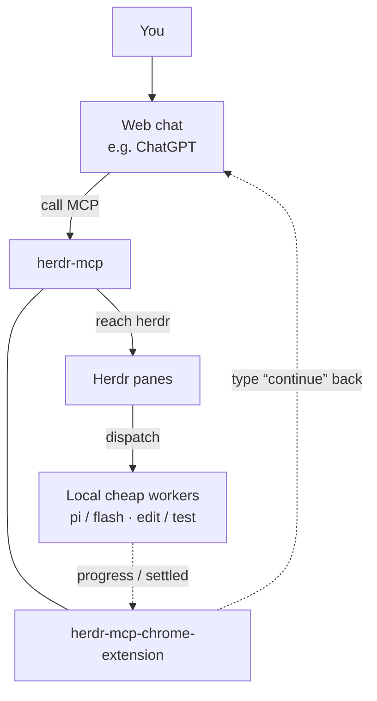

# herdr-mcp

Help web SOTA models reach local [herdr](https://herdr.dev), enter your project, and schedule on-machine agents to assist development.

**Languages (same as herdr):** [English](README.md) (default on GitHub) · [简体中文](README.zh.md) · [日本語](README.ja.md).  
CLI / browser extension: first install follows system language (`en` / `zh` / `ja`); unknown → English. Change anytime: `herdr-mcp lang`, or extension Options → Language.

## Architecture (you ↔ web ↔ MCP ↔ herdr; extension as reverse channel)

Top to bottom: you → web chat → (herdr-mcp and chrome-extension **same row**) → Herdr panes → local agents.  
Agents’ progress / settled events reach the extension; the extension ↻ types “continue” back into the web chat. Details: [docs/extension-wake.md](docs/extension-wake.md) (中文).

**Orchestration bias (web plans, local stays cheap):** the web model owns the plan. Prefer `herdr_fs_*` / `herdr_exec` (no local-agent API). If an agent is needed, `herdr_prompt` a cheap/fast worker directly — do not route through local Claude/OMP/main as a middle manager. `inspect`/`since` soft-hide Claude/OMP/Codex by default (list pi/cline/opencode/anti + droid/grok only); prompting by known pane still works. `HERDR_MCP_AGENT_ALLOW=*` shows all.



## Platforms and start

Same OS coverage as [herdr](https://herdr.dev): **macOS / Linux / Windows** (Node.js 20+). herdr-mcp does not scan herdr’s install directory — it connects to the API socket (default `~/.config/herdr/herdr.sock`, override with `HERDR_SOCKET_PATH`) and runs `herdr api schema` from your `PATH`.

Start (foreground is enough):

```bash
export HERDR_MCP_TOKEN="$(openssl rand -hex 16)"   # or reuse an existing token
export HERDR_MCP_PORT=8772
# for a public Connector (no /mcp suffix):
# export HERDR_MCP_BASE_URL=https://xxxx.trycloudflare.com
node dist/server.js
```

Login items, systemd, Task Scheduler, etc. are your choice — out of scope here. On macOS you may optionally symlink `bin/herdr-mcp` for `status` / `logs`; the core is always the Node process above.

## Install (zero to working)

### 0. Prerequisites

- [herdr](https://herdr.dev) installed and running
- Node.js 20+ (`node -v`)
- For ChatGPT: public HTTPS via `cloudflared` ([Quick Tunnel](https://developers.cloudflare.com/cloudflare-one/connections/connect-networks/do-more-with-tunnels/trycloudflare/)) or your own domain

### 1. Download and build

```bash
git clone https://github.com/whshang/herdr-mcp.git
cd herdr-mcp
npm install
npx tsc
mkdir -p ~/.config/herdr-mcp
```

### 2. Start the local MCP server

```bash
export HERDR_MCP_TOKEN="$(openssl rand -hex 16)"
echo "token=$HERDR_MCP_TOKEN"   # keep for Cursor / the browser extension
node dist/server.js
# optional check: curl -s -o /dev/null -w '%{http_code}\n' http://127.0.0.1:8772/
```

### 3. Connect ChatGPT (recommended: free Cloudflare)

In another terminal:

```bash
cloudflared tunnel --url http://127.0.0.1:8772
# note https://xxxx.trycloudflare.com
```

Restart MCP with that origin (**no** `/mcp`):

```bash
export HERDR_MCP_BASE_URL=https://xxxx.trycloudflare.com
export HERDR_MCP_TOKEN=...   # same as before
node dist/server.js
```

#### Add the Connector in ChatGPT **web** (not the chat UI / desktop app)

You **cannot** add an MCP server from inside a ChatGPT client chat. Use the website:

1. Open [https://chatgpt.com/#settings/Plugins](https://chatgpt.com/#settings/Plugins), turn on **Developer mode**
2. Open [https://chatgpt.com/plugins#settings/Connectors?create-connector=true](https://chatgpt.com/plugins#settings/Connectors?create-connector=true)
3. Enter a name and the MCP URL `https://xxxx.trycloudflare.com/mcp` (same as `HERDR_MCP_BASE_URL` + `/mcp`)
4. Click login and wait for the redirect back (this server’s OAuth flow is effectively login-free — **do not** paste an API key / token)
5. Start a **new** chat after connecting (old chats keep a stale tool snapshot)

#### Errors or tools missing

If you see:

- `Error fetching OAuth configuration` / `MCP server https://xxx.trycloudflare.com/mcp does not implement OAuth`
- `There was a problem connecting xxx. Try again later.`
- Or the connector shows as added but tools never appear

First confirm `HERDR_MCP_BASE_URL` matches the HTTPS origin ChatGPT uses, `cloudflared` is still running, and `herdr-mcp status` shows the public URL reachable. If that looks fine, **reconnect a few times** in the plugins / connectors UI — usually ChatGPT cache or network. Hard requirements: [docs/chatgpt-connector.md](docs/chatgpt-connector.md) (中文).

#### Model access

Free ChatGPT is limited to **GPT-5.5-mini**. Plus (or higher) lets you use stronger SOTA models in chat, near-unlimited, to drive projects on your machine via the connector.

Quick Tunnel hostnames change when you restart `cloudflared` — update `HERDR_MCP_BASE_URL` and `herdr-mcp restart`. For a stable hostname, use a named Cloudflare tunnel or your own domain.
### 6. Cursor (optional, this machine)

`~/.cursor/mcp.json` — local only (do not also enable the public URL in the same profile):

```json
{
  "mcpServers": {
    "herdr-mcp-local": {
      "url": "http://127.0.0.1:8772/mcp",
      "headers": {
        "Authorization": "Bearer <paste: herdr-mcp token>"
      }
    }
  }
}
```

## Endpoints

| Use | URL |
|---|---|
| Local MCP | `http://127.0.0.1:8772/mcp` |
| Public MCP | `{HERDR_MCP_BASE_URL}/mcp` |
| Browser extension push | `http://127.0.0.1:8772/push/events` |

Auth for connectors: **OAuth (DCR)**. Static Bearer is for local curl / Cursor only (`herdr-mcp token`).

## CLI

```bash
herdr-mcp              # menu
herdr-mcp status
herdr-mcp connector
herdr-mcp start | stop | restart
herdr-mcp logs [-f]
herdr-mcp token | url
herdr-mcp lang [en|zh|ja]   # UI language (first run: system; default en)
herdr-mcp watchdog install  # every 120s: restart MCP if down; TaskGroup = log only
herdr-mcp watchdog status
```

After code changes: `npx tsc && herdr-mcp restart`.

## Default tools (why these 17)

herdr’s native surface is a large Unix-socket API (`herdr api schema`, ~90 methods). herdr-mcp does **not** re-wrap every method as an MCP tool (that burns context and duplicates herdr). Instead:

| Layer | MCP tools | Relation to herdr |
|---|---|---|
| Passthrough | `herdr_methods`, `herdr_call` | Thin gate to the **native** socket API. Discover with `herdr_methods`, then call any method via `herdr_call`. |
| Remote orchestration | `herdr_inspect`, `herdr_since`, `herdr_prompt` | Small helpers for web clients that only run when the user sends a message (no local polling loop). Built on snapshot/events/`agent.prompt` — not new herdr features. |
| Remote workstation | `herdr_fs_*`, `herdr_exec` / `herdr_exec_*`, `herdr_git` | **Not** herdr tools. The MCP client runs off-machine and cannot see your disk; these fill that gap under managed git roots. |

| Tool | What it does |
|---|---|
| `herdr_methods` | List live herdr socket methods + parameter schemas (cached reflection). Use before unknown `herdr_call`s. |
| `herdr_call` | Call any herdr method with validated params (`{ method, params }`). Covers panes, workspaces, agents, etc. without one MCP tool per method. |
| `herdr_inspect` | One-shot: connection health + workspaces / tabs / panes / agents (cwd, status), plus `workstation_info`, `boot_id`, and `exec_sessions`. Usual first call. |
| `herdr_since` | Cheap digest since a cursor — resume a conversation without re-dumping full state (`boot_id` / `cursor_reset` across MCP restarts). |
| `herdr_prompt` | Deliver via socket `agent.prompt` (default fire-and-forget; strongly prefer `idempotency_key`; track with `herdr_since` / `herdr_inspect`). Prefer cheap workers; do not hand planning/delegation to local Claude/OMP. |
| `herdr_fs_read` | Read a file inside a managed git project on the workstation. |
| `herdr_fs_list` | List a directory under a managed root (skips `.git` / secret-ish names). |
| `herdr_fs_grep` | Search file contents under a managed root (`rg` when available). |
| `herdr_fs_write` | Create / overwrite a file (`overwrite:true` required to replace; dirty / busy gates). |
| `herdr_fs_edit` | Exact unique string replace in a file (same gates as write). |
| `herdr_fs_patch` | coding-tools-style `*** Begin Patch` multi-file patch (`dry_run`). |
| `herdr_fs_image` | Read an image under a managed root; return MCP image content. |
| `herdr_git` | Deterministic `status` / `diff` / `log` (do not spend a local agent on this). |
| `herdr_exec` | Short shell in the workspace’s visible `herdr-mcp:utility` pane. If control-plane TaskGroup blocks pane ops **before** the command is sent, falls back to a local zsh (`backend:local_fallback`) — never double-runs after delivery. |
| `herdr_exec_start` / `read` / `kill` | Long background shell sessions (local process, not the utility pane). |

Optional: `HERDR_MCP_ALL_TOOLS=1` adds advanced/deprecated lifecycle tools. Mutations stay in managed git roots; `HERDR_MCP_READONLY=1` / `HERDR_MCP_WRITE_ROOTS=/a,/b` tighten writes.

## Browser extension

Folder: `extension/` (MV3). Load unpacked in `chrome://extensions`.

Two equal jobs ([docs/extension.md](docs/extension.md), 中文):

1. **Progress nudge** — bind a ChatGPT (etc.) conversation to a herdr **workspace**; any agent in that space with new output / settle can nudge; full settle only when none remain working.
2. **JSON → MCP** — on DeepSeek / z.ai (no connector), parse assistant `{"tool":...}` → local `/mcp`

Same local `127.0.0.1:8772` token. Not a substitute for ChatGPT’s OAuth connector.

## Docs

| Doc | Topic |
|---|---|
| [docs/extension.md](docs/extension.md) | Extension dual tracks（中文） |
| [docs/architecture.md](docs/architecture.md) | herdr vs MCP tool layers（中文） |
| [docs/chatgpt-connector.md](docs/chatgpt-connector.md) | ChatGPT OAuth / 线路 / schema / 权限卡（中文） |
| [docs/extension-wake.md](docs/extension-wake.md) | Track A: progress nudge（中文） |
| [docs/extension-bridge.md](docs/extension-bridge.md) | Track B: JSON→MCP（中文） |
| [tests/README.md](tests/README.md) | Default vs manual tests |

Process notes live in `docs/_wip/` (gitignored).

## Ops

```bash
npx tsc          # rebuild after code changes
# restart whatever process runs node dist/server.js
```

Sessions: `~/.config/herdr-mcp/sessions/`.
