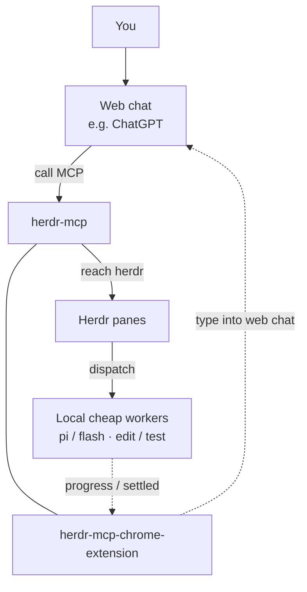

# herdr-mcp

MCP HTTP gateway so ChatGPT (and other web LLMs) can drive local [Herdr](https://herdr.dev): inspect panes and agents, edit git-managed projects, run shells, and prompt cheap on-machine workers. A Chrome extension types progress / continue back into the bound web chat.

**Docs:** https://whshang.github.io/herdr-mcp/ · **Source:** https://github.com/whshang/herdr-mcp

[](https://github.com/whshang/herdr-mcp/actions/workflows/ci.yml) [](https://github.com/whshang/herdr-mcp/actions/workflows/pages.yml) [](https://github.com/whshang/herdr-mcp/actions/workflows/cloudflare-edge.yml)

[Herdr](https://herdr.dev) is a terminal multiplexer for coding agents. This repo is the door for **remote** clients that cannot see your socket or disk. It does **not** re-wrap Herdr’s ~90 native methods as MCP tools.

**This repo does not:** replace Herdr; give DeepSeek a fake OAuth connector; expose the extension anywhere but localhost (it talks to `127.0.0.1` only).

**Languages (same as herdr):** [English](README.md) (default on GitHub) · [简体中文](README.zh.md) · [日本語](README.ja.md).  
CLI / browser extension: first install follows system language (`en` / `zh` / `ja`); unknown → English. Change anytime: `herdr-mcp lang`, or extension Options → Language.

## Architecture (you ↔ web ↔ MCP ↔ herdr; extension as reverse channel)

Top to bottom: you → web chat → (herdr-mcp and chrome-extension **same row**) → Herdr panes → local agents.  
Agents’ progress / settled events reach the extension; the extension ↻ types into the web chat. Details: [docs/i18n/en/extension-wake.md](docs/i18n/en/extension-wake.md).

**Orchestration (web plans, local stays cheap):**

- Prefer `herdr_fs_*` / `herdr_git` / `herdr_exec` (no local-agent API).
- If reasoning is required, prefer `herdr_prompt` to a cheap/fast Herdr worker (`pi`, `flash`, `cline`, `opencode`, `anti`) or auditor (`droid`, `grok`) — do not route through local Claude/OMP/main.
- If Pi/Herdr workers are unavailable, `dsh --profile headless "job"` is a tested CLI fallback. Run it through a long `herdr_exec_start` session, not a 60s synchronous shell: tool edits may complete before the final headless answer is printed. `dsh-tui` is the human-interactive fallback, not the default automation surface. See [worker fallbacks](docs/i18n/en/worker-fallbacks.md).
- `inspect`/`since` soft-hide Claude/OMP/Codex by default. Prompting by known pane still works. `HERDR_MCP_AGENT_ALLOW=*` shows all.
- Current sessions use the frozen contract epoch 2 surface: **18 tools including `herdr_skill`**. Start with `herdr_inspect` → `herdr_skill` (once) → work.



## Platforms and start

The **Node server** runs wherever Herdr does: **macOS / Linux / Windows** (Node.js 20+). It does not scan Herdr’s install directory — it connects to the API socket (default `~/.config/herdr/herdr.sock`, override `HERDR_SOCKET_PATH`) and runs `herdr api schema` from `PATH`.

Two ways to run:

| Path | Who | How |
|---|---|---|
| Foreground | any OS | `node dist/server.js` (below) |
| `herdr-mcp` CLI | **macOS** LaunchAgent | `bin/herdr-mcp start` / `status` / `logs` / `watchdog` |

`npm` `bin` is `dist/server.js`, not the bash CLI. On macOS you may `ln -sf …/bin/herdr-mcp ~/.local/bin/herdr-mcp`. systemd / Task Scheduler are out of scope.

```bash
export HERDR_MCP_TOKEN="$(openssl rand -hex 16)"   # or reuse an existing token
export HERDR_MCP_PORT=8772
# for a public Connector (no /mcp suffix):
# export HERDR_MCP_BASE_URL=https://herdr-edge.<your-account>.workers.dev
node dist/server.js
```

## Install with a local Agent

If you use a local coding Agent such as Codex, Claude Code, Pi, DSH or Cline, paste the prompt below into that Agent. The README intentionally does not duplicate the bootstrap procedure: the Agent must read the single authoritative guide first, then perform the clone, install, local-service setup and default `workers.dev` Edge deployment from that guide.

```text
Install and deploy herdr-mcp from zero. Do not infer the procedure from this prompt. First read the authoritative install guide:
https://raw.githubusercontent.com/whshang/herdr-mcp/main/docs/i18n/en/agent-install.md

Follow that document exactly. You own environment checks, safe clone/update, dependency installation, build, local MCP startup, Herdr socket verification, and deployment of the default Cloudflare workers.dev Edge.

Do not stop and ask me to run commands unless a human Cloudflare login/API Token creation is required, or my Cloudflare identity exposes multiple Accounts and you need me to choose one. When Cloudflare credentials are required, give me the exact dashboard/API Token page, required permissions and scope, then wait for me to paste the Token back into this local-Agent conversation and continue the deployment automatically.

After receiving the Cloudflare Token, never echo it and never write it to the repository, .env files, logs, screenshots or shell history. Use only a temporary process environment or mode-0600 temporary file and clean it immediately after deployment. Do not create a Custom Domain, DNS records or a Tunnel during first install; use workers.dev only.

At the end report: local MCP status, Herdr Link status, Cloudflare Account, Worker name, workers.dev origin, /health URL, /mcp URL, and the next steps for creating the ChatGPT Connector. Diagnose failures before retrying and never repeat a mutation that already succeeded.
```

Authoritative workflow: [Local-Agent install and workers.dev deployment](docs/i18n/en/agent-install.md).

## Install (zero to working)

### 0. Prerequisites

- [herdr](https://herdr.dev) installed and running
- Node.js 20+ (`node -v`)
- For ChatGPT: a Cloudflare Worker endpoint on `workers.dev` (default, no custom domain required); a Custom Domain is optional for a stable long-lived origin.

### 1. Download and build

```bash
git clone https://github.com/whshang/herdr-mcp.git
cd herdr-mcp
npm install
npx tsc
mkdir -p ~/.config/herdr-mcp
```

### 2. Start the local MCP server

```bash
export HERDR_MCP_TOKEN="$(openssl rand -hex 16)"
echo "token=$HERDR_MCP_TOKEN"   # keep for Cursor / local administration
node dist/server.js
# optional check: curl -s -o /dev/null -w '%{http_code}\n' http://127.0.0.1:8772/
```

### 3. Connect ChatGPT through Cloudflare Edge

The supported default does **not** require your own domain. Deploy the Edge to your Cloudflare account's `workers.dev` hostname first:

```bash
cp edge/cloudflare/wrangler.user.example.toml edge/cloudflare/wrangler.user.toml
# edit worker name, workstation id and OAUTH_ISSUER for your workers.dev origin
cd edge/cloudflare
npx wrangler deploy --config wrangler.user.toml
```

Use the resulting stable origin, for example:

```text
https://herdr-edge.<your-account-subdomain>.workers.dev/mcp
```

If you own a Cloudflare zone, a Custom Domain such as `herdr.example.com` is **recommended but optional**. Always validate the Worker on `workers.dev` first; then attach the custom hostname separately. See [Cloudflare Edge deployment](docs/i18n/en/cloudflare-edge-deployment.md) and [Cloudflare Edge token](docs/i18n/en/cloudflare-edge-token.md).

Runtime releases can switch behind the persistent Edge/Link without changing the ChatGPT Connector. See [Runtime A/B self-upgrade](docs/i18n/en/runtime-self-upgrade.md).

#### Add the Connector in ChatGPT **web**

1. Open ChatGPT settings and enable **Developer mode**.
2. Create a custom MCP connector.
3. Enter the Edge MCP URL (`https://<worker>.<account>.workers.dev/mcp` or your optional Custom Domain + `/mcp`).
4. Complete OAuth in the browser; do not paste the local Herdr token into ChatGPT.
5. Start a new chat after connecting so it receives a fresh tool snapshot.

#### Errors or tools missing

Verify the same origin is used consistently for the MCP URL and `OAUTH_ISSUER`, then check Edge health, `herdr-link` connectivity and OAuth discovery. Hard requirements and diagnostics are documented in [docs/i18n/en/chatgpt-connector.md](docs/i18n/en/chatgpt-connector.md).

#### Model access

Available ChatGPT models depend on your ChatGPT plan and current product configuration; Herdr does not alter those limits.

### 4. Cursor (optional, this machine)

`~/.cursor/mcp.json` — local only (do not also enable the public URL in the same profile):

```json
{
  "mcpServers": {
    "herdr-mcp-local": {
      "url": "http://127.0.0.1:8772/mcp",
      "headers": {
        "Authorization": "Bearer <paste: herdr-mcp token>"
      }
    }
  }
}
```

### 5. Browser extension (optional)

Folder: `extension/` (MV3). Chrome shows the name **herdr → Web wake**. Run `bin/herdr-extension-host install`, then load unpacked in `chrome://extensions`. Current extension traffic goes through Chrome Native Messaging to the runtime's mode-`0600` `~/.config/herdr-mcp/extension.sock`; the browser receives and stores no Herdr bearer. See [Browser extension](#browser-extension).

## Endpoints

| Use | URL |
|---|---|
| Local MCP | `http://127.0.0.1:8772/mcp` |
| Public MCP | `{HERDR_MCP_BASE_URL}/mcp` |
| Extension SSE | `http://127.0.0.1:8772/push/events` |
| Extension snapshot | `http://127.0.0.1:8772/push/state` |

Auth for connectors: **OAuth (DCR / CIMD)**. Static `HERDR_MCP_TOKEN` remains for local curl / Cursor and for the Native Messaging host's old-runtime HTTP fallback. The current browser extension receives no Herdr token; its trusted local path is Native Messaging → mode-`0600` Unix socket. Never paste the static token into the ChatGPT connector UI.

## CLI (macOS)

```bash
herdr-mcp              # menu
herdr-mcp status
herdr-mcp connector
herdr-mcp start | stop | restart   # LaunchAgent
herdr-mcp logs [-f]
herdr-mcp token | url
herdr-mcp lang [en|zh|ja]   # UI language (first run: system; default en)
herdr-mcp watchdog install  # every 120s: restart MCP if down; TaskGroup = log only
herdr-mcp watchdog status
```

After code changes: `npx tsc && herdr-mcp restart` (or restart the `node dist/server.js` process).

## Default tools (why these 18)

Herdr’s native surface is a large Unix-socket API (`herdr api schema`, ~90 methods). herdr-mcp does **not** re-wrap every method as an MCP tool (that burns context and duplicates herdr). Runtime 0.3.32 freezes the production ChatGPT ABI at **contract epoch 2 / 18 tools**, including `herdr_skill`. Epoch 1 / 17 tools is retained only for supervised rollback and old-session compatibility. Instead of registering every native method:

| Layer | MCP tools | Relation to herdr |
|---|---|---|
| Skill | `herdr_skill` | Read-only copy of upstream Herdr `SKILL.md` (this process fetches GitHub; ChatGPT does not). |
| Passthrough | `herdr_methods`, `herdr_call` | Thin gate to the **native** socket API. Discover with `herdr_methods`, then call any method via `herdr_call`. |
| Remote orchestration | `herdr_inspect`, `herdr_since`, `herdr_prompt` | Small helpers for web clients that only run when the user sends a message (no local polling loop). Built on snapshot/events/`agent.prompt` — not new herdr features. |
| Remote workstation | `herdr_fs_*`, `herdr_exec` / `herdr_exec_*`, `herdr_git` | **Not** herdr tools. The MCP client runs off-machine and cannot see your disk; these fill that gap under managed git roots. |

| Tool | What it does |
|---|---|
| `herdr_skill` | Read-only: prefer latest `SKILL.md` from herdr **master**; if the network fails, use the bundled copy (`assets/herdr-agent-SKILL.md`). Call it once per session before agent operations. `HERDR_SKILL_NETWORK=0` forces bundled. |
| `herdr_methods` | List live herdr socket methods + parameter schemas (cached reflection). Use before unknown `herdr_call`s. |
| `herdr_call` | Call any herdr method with validated params (`{ method, params }`). Covers panes, workspaces, agents, etc. without one MCP tool per method. |
| `herdr_inspect` | One-shot: connection health + workspaces / tabs / panes / agents (cwd, status), plus `workstation_info`, `boot_id`, and `exec_sessions`. Usual first call. |
| `herdr_since` | Cheap digest since a cursor — resume a conversation without re-dumping full state (`boot_id` / `cursor_reset` across MCP restarts). |
| `herdr_prompt` | Deliver via socket `agent.prompt` (default fire-and-forget; strongly prefer `idempotency_key`; track with `herdr_since` / `herdr_inspect`). Prefer cheap workers; do not hand planning/delegation to local Claude/OMP. |
| `herdr_fs_read` | Read a file inside a managed git project on the workstation. |
| `herdr_fs_list` | List a directory under a managed root (skips `.git` / secret-ish names). |
| `herdr_fs_grep` | Search file contents under a managed root (`rg` when available). |
| `herdr_fs_write` | Create / overwrite a file (`overwrite:true` required to replace; dirty / busy gates). |
| `herdr_fs_edit` | Exact unique string replace in a file (same gates as write). |
| `herdr_fs_patch` | coding-tools-style `*** Begin Patch` multi-file patch (`dry_run`). |
| `herdr_fs_image` | Read an image under a managed root; return MCP image content. |
| `herdr_git` | Deterministic `status` / `diff` / `log` (do not spend a local agent on this). |
| `herdr_exec` | Short shell in the workspace’s visible `herdr-mcp:utility` pane. If control-plane TaskGroup blocks pane ops **before** the command is sent, falls back to a local zsh (`backend:local_fallback`) — never double-runs after delivery. |
| `herdr_exec_start` / `read` / `kill` | Long background shell sessions (local process, not the utility pane). |

Optional: `HERDR_MCP_ALL_TOOLS=1` adds lifecycle tools (30 total). Mutations stay in managed git roots; `HERDR_MCP_READONLY=1` / `HERDR_MCP_WRITE_ROOTS=/a,/b` tighten writes.

## Environment

| Variable | Default | Role |
|---|---|---|
| `HERDR_MCP_TOKEN` | empty | Static Bearer for TCP `/mcp` and `/push` (Cursor / curl); also used internally by the Native Messaging host only when falling back to an older runtime without the trusted IPC socket. |
| `HERDR_MCP_PORT` | `8772` | Listen port. |
| `HERDR_MCP_BASE_URL` | empty | Public origin for ChatGPT, **no** `/mcp` suffix. Required for OAuth `iss`/`aud`. |
| `HERDR_SOCKET_PATH` | `~/.config/herdr/herdr.sock` | Herdr API socket. |
| `HERDR_MCP_READONLY` | off | Block mutations including `herdr_prompt` (`herdr_fs_patch` `dry_run` still allowed). |
| `HERDR_MCP_WRITE_ROOTS` | all managed roots | CSV of roots that may be written. |
| `HERDR_MCP_ALL_TOOLS` | off | Register 30 tools instead of 18. |
| `HERDR_MCP_AGENT_ALLOW` | workers + auditors | `*` shows Claude/OMP/Codex in inspect/since; comma list overrides. |
| `HERDR_SKILL_NETWORK` | on | `0` = bundled `SKILL.md` only. |

More OAuth / skill / state dirs: [docs/i18n/en/architecture.md](docs/i18n/en/architecture.md#environment-variables).

## Trust

A connected ChatGPT session can read and write files under managed git roots and run shell via `herdr_exec`. The extension stays local and reaches Herdr through Chrome Native Messaging plus the runtime's mode-`0600` Unix socket; no Herdr bearer enters browser storage or the service worker. Secret-path checks apply to `herdr_fs_*` only — a shell can still `cat .env`. Use `HERDR_MCP_READONLY` / `HERDR_MCP_WRITE_ROOTS` to tighten.

## Browser extension

Folder: `extension/` (MV3, Chrome name **herdr → Web wake**). Load unpacked in `chrome://extensions`. Sites: chatgpt.com, claude.ai, chat.deepseek.com, chat.z.ai.

Two jobs ([docs/i18n/en/extension.md](docs/i18n/en/extension.md)) — they share the localhost transport and extension credential broker; they are **not** equally finished:

1. **Web continuity automation (shipping)** — Options selects **Manual globally / Per-Project automation**. The bottom HUD exposes **Manual continue / Herdr monitor / LLM analysis / Manual handoff**, plus `Auto on|off` when automation is permitted. ChatGPT stores automation by stable `project_id`; z.ai / DeepSeek store it per conversation. Since 0.1.47, `Auto on` locks every HUD manual action, including Manual handoff. Version 0.1.48 lets z.ai / DeepSeek save the conversation Auto preference even before a workspace is bound; Herdr progress/settled push-back starts once binding exists. Bound persisted z.ai `/c/<chat_id>` conversations also support the fail-closed handoff flow. A z.ai new-chat root binding/preference migrates once to the first `/c/<chat_id>` created in that tab, but never follows navigation between existing histories.
2. **JSON → MCP (shipping)** — on DeepSeek / z.ai the local JSON bridge drives `tools/list` / `tools/call` through the Native Messaging host in controlled sequential rounds, continuing until the assistant returns a normal non-JSON answer, and feeds results back into the web chat. The host reaches the same local MCP runtime over the trusted Unix socket; neither the service worker nor page JavaScript receives a Herdr bearer. See [docs/i18n/en/extension-bridge.md](docs/i18n/en/extension-bridge.md).

Same local Herdr runtime, reached through Native Messaging IPC by the current extension. This is not a substitute for ChatGPT’s OAuth connector. Defaults: progress check every **60s**, unchanged-summary fallback **20 min** (`progressTickSec` / `progressFallbackSec`).

## Docs

| Doc | Topic |
|---|---|
| [CHANGELOG.md](CHANGELOG.md) | Version / tool-surface changes |
| [docs/i18n/en/architecture.md](docs/i18n/en/architecture.md) | herdr vs MCP layers, gates, env |
| [docs/i18n/en/install.md](docs/i18n/en/install.md) | Install and quick start |
| [docs/i18n/en/chatgpt-connector.md](docs/i18n/en/chatgpt-connector.md) | ChatGPT OAuth / wire / schema / permission cards |
| [docs/i18n/en/extension.md](docs/i18n/en/extension.md) | Extension overview |
| [docs/i18n/en/extension-wake.md](docs/i18n/en/extension-wake.md) | Track A: progress nudge |
| [docs/i18n/en/extension-bridge.md](docs/i18n/en/extension-bridge.md) | Track B: local JSON→MCP (shipping) |
| [docs/i18n/en/cli-reference.md](docs/i18n/en/cli-reference.md) | herdr-mcp CLI / bin tools / env vars |
| [docs/i18n/en/best-practices.md](docs/i18n/en/best-practices.md) | Operating rules and an end-to-end example |
| [docs/i18n/en/troubleshooting.md](docs/i18n/en/troubleshooting.md) | Symptom-first checklist |
| [tests/README.md](tests/README.md) | Default vs manual tests |

Process notes live in `docs/_wip/` (gitignored).

## Ops

```bash
npx tsc          # rebuild after code changes
# restart whatever process runs node dist/server.js
```

Sessions: `~/.config/herdr-mcp/sessions/`.
