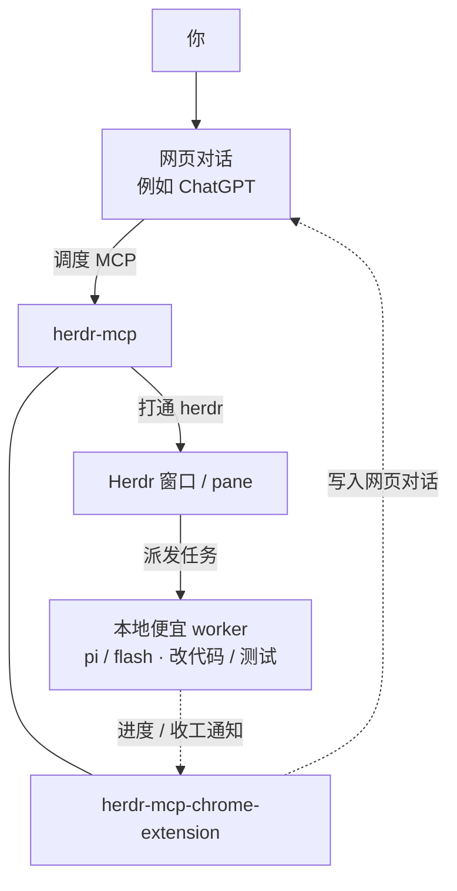

# herdr-mcp

MCP HTTP 门面：让 ChatGPT（及其它网页模型）驱动本机 [Herdr](https://herdr.dev)——查看窗格与 agent、在托管 git 项目里读改文件、跑命令，并给便宜的本地 worker 派活。浏览器扩展再把进度 / 收工写回绑定的网页对话。

**文档站：** https://whshang.github.io/herdr-mcp/ · **源码：** https://github.com/whshang/herdr-mcp

[Herdr](https://herdr.dev) 是给 coding agent 用的终端复用器。本仓库给**看不到**本机 socket 和磁盘的远程客户端当门。它**不会**把 herdr 约 90 个原生方法逐个做成 MCP 工具。

**本仓库不做：** 替代 herdr；给 DeepSeek 装假的 OAuth connector；把扩展暴露到公网（扩展只连 `127.0.0.1`）。

**语言（与 herdr 一致）：** [English](README.md)（GitHub 默认）· [简体中文](README.zh.md) · [日本語](README.ja.md)。  
CLI / 浏览器插件：首次安装跟系统语言（`en` / `zh` / `ja`），未知则英语。可随时改：`herdr-mcp lang`，或插件选项页 → 语言。

## 架构（用户 ↔ 网页 ↔ MCP ↔ herdr，插件做反向通道）

自上而下：你 → 网页对话 →（herdr-mcp 与 chrome-extension **同排**）→ Herdr 窗口 → 本地 Agents。  
Agents 的进度/收工通知到 extension；extension 再 ↻ 写入网页输入框。详见 [docs/i18n/zh-CN/extension-wake.md](docs/i18n/zh-CN/extension-wake.md)。

**编排（网页规划，本机省 API）：**

- 能用 `herdr_fs_*` / `herdr_git` / `herdr_exec` 就不要开本地 agent。
- 必须推理时，优先 `herdr_prompt` 给便宜/高速的 Herdr 原生 worker（`pi`、`flash`、`cline`、`opencode`、`anti`）或审计（`droid`、`grok`），不要经本机 Claude/OMP/main 再转派。
- Pi/Herdr worker 不可用时，实测可用 `dsh --profile headless "任务"` 作为开发 CLI 备选，但要通过 `herdr_exec_start` 长任务 session 跑；DSH 可能已经改完代码却还没在 60 秒内打印最终回复，超时后必须先看 Git/test 再决定是否重试。`dsh-tui` 只作为人工交互接管。详见 [worker fallbacks](docs/i18n/zh-CN/worker-fallbacks.md)。
- `inspect`/`since` 默认软隐藏 Claude/OMP/Codex。知道 pane 仍可 prompt。`HERDR_MCP_AGENT_ALLOW=*` 显示全部。
- 当前统一使用冻结的 contract epoch 2：**18 tools，包含 `herdr_skill`**。会话开始：`herdr_inspect` → `herdr_skill`（一次）→ 干活。



## 平台与启动

**Node 服务**支持系统与 [herdr](https://herdr.dev) 一致：**macOS / Linux / Windows**（Node.js 20+）。不扫 herdr 安装目录，只连 API socket（默认 `~/.config/herdr/herdr.sock`，可用 `HERDR_SOCKET_PATH` 覆盖），并调用 PATH 上的 `herdr api schema`。

两种跑法：

| 方式 | 适用 | 怎么做 |
|---|---|---|
| 前台 | 任意 OS | 下面的 `node dist/server.js` |
| `herdr-mcp` CLI | **仅 macOS** LaunchAgent | `bin/herdr-mcp start` / `status` / `logs` / `watchdog` |

`npm` 的 `bin` 是 `dist/server.js`，不是 bash CLI。macOS 可 `ln -sf …/bin/herdr-mcp ~/.local/bin/herdr-mcp`。systemd / 任务计划不在本项目范围。

```bash
export HERDR_MCP_TOKEN="$(openssl rand -hex 16)"   # 或沿用已有 token
export HERDR_MCP_PORT=8772
# 公网 Connector 时再设（不要带 /mcp）:
# export HERDR_MCP_BASE_URL=https://herdr-edge.<你的-account>.workers.dev
node dist/server.js
```

## 安装（从零到可用）

### 0. 前置

- 已安装并正在运行 [herdr](https://herdr.dev)
- Node.js 20+（`node -v`）
- 接 ChatGPT 推荐使用 Cloudflare Worker 的 `workers.dev` 公网 HTTPS（不要求自有域名）；Custom Domain 只是稳定长期入口的可选增强。

### 1. 下载与构建

```bash
git clone https://github.com/whshang/herdr-mcp.git
cd herdr-mcp
npm install
npx tsc
mkdir -p ~/.config/herdr-mcp
```

### 2. 启动本机 MCP

```bash
export HERDR_MCP_TOKEN="$(openssl rand -hex 16)"
echo "token=$HERDR_MCP_TOKEN"   # 留给 Cursor / 浏览器插件
node dist/server.js
# 另开终端自检: curl -s -o /dev/null -w '%{http_code}\n' http://127.0.0.1:8772/
```

### 3. 通过 Cloudflare Edge 接到 ChatGPT

默认路径**不要求自有域名**。先把 Edge 部署到 Cloudflare 自动提供的 `workers.dev`：

```bash
cp edge/cloudflare/wrangler.user.example.toml edge/cloudflare/wrangler.user.toml
# 修改 Worker 名、workstation ID，以及 workers.dev 对应的 OAUTH_ISSUER
cd edge/cloudflare
npx wrangler deploy --config wrangler.user.toml
```

部署后使用类似下面的稳定地址：

```text
https://herdr-edge.<你的-account-subdomain>.workers.dev/mcp
```

如果已经有自己的 Cloudflare zone，可以再绑定 `herdr.example.com` 这样的 Custom Domain。**这是推荐项，不是前置条件。** 必须先在 `workers.dev` 上把 Worker、WSS Link、MCP 和 OAuth 验证通过，再独立绑定生产域名。详见 [Cloudflare Edge 部署](docs/i18n/zh-CN/cloudflare-edge-deployment.md) 和 [Cloudflare Edge Token](docs/i18n/zh-CN/cloudflare-edge-token.md)。

Runtime 升级可以在稳定的 Edge/Link 后面做 A/B 切代，不需要修改 ChatGPT Connector。详见 [Runtime A/B 自升级](docs/i18n/zh-CN/runtime-self-upgrade.md)。

#### 在 ChatGPT 网页添加 Connector

1. 在 ChatGPT 设置里开启 **Developer mode**。
2. 创建自定义 MCP Connector。
3. 填写 Edge MCP 地址：`https://<worker>.<account>.workers.dev/mcp`，或者可选 Custom Domain + `/mcp`。
4. 在浏览器完成 OAuth；不要把本机 Herdr Token 填进 ChatGPT。
5. 配好后开一个新对话，让它获取新的 tool snapshot。

#### 报错或工具没刷出来

先确认 MCP URL 与 `OAUTH_ISSUER` 使用同一个稳定 origin，再检查 Edge `/health`、`herdr-link` 在线状态和 OAuth discovery。硬性要求与诊断方法见 [docs/i18n/zh-CN/chatgpt-connector.md](docs/i18n/zh-CN/chatgpt-connector.md)。

#### 模型额度

ChatGPT 可用模型取决于当前套餐和产品配置，Herdr 不改变 ChatGPT 自身的额度或模型限制。

### 4. Cursor（可选，本机）

`~/.cursor/mcp.json` 只挂本地（同一配置里不要再挂公网）：

```json
{
  "mcpServers": {
    "herdr-mcp-local": {
      "url": "http://127.0.0.1:8772/mcp",
      "headers": {
        "Authorization": "Bearer <执行 herdr-mcp token 后粘贴>"
      }
    }
  }
}
```

### 5. 浏览器插件（可选）

目录 `extension/`（MV3）。Chrome 里显示名称 **herdr → Web wake**。`chrome://extensions` 加载未打包扩展。选项填 `http://127.0.0.1:8772` 与同一静态 token。见 [浏览器插件](#浏览器插件)。

## 地址速查

| 用途 | URL |
|---|---|
| 本机 MCP | `http://127.0.0.1:8772/mcp` |
| 公网 MCP | `{HERDR_MCP_BASE_URL}/mcp` |
| 扩展 SSE | `http://127.0.0.1:8772/push/events` |
| 扩展快照 | `http://127.0.0.1:8772/push/state` |

Connector 认证走 **OAuth（自动注册）**。静态 Bearer 只给本机 curl / Cursor / 扩展：`herdr-mcp token`。不要把该 token 贴进 ChatGPT connector 表单。

## 命令行（macOS）

```bash
herdr-mcp              # 菜单
herdr-mcp status
herdr-mcp connector
herdr-mcp start | stop | restart   # LaunchAgent
herdr-mcp logs [-f]
herdr-mcp token | url
herdr-mcp lang [en|zh|ja]   # 界面语言（首次跟系统；未知则英语）
herdr-mcp watchdog install  # 每 120s 自检：MCP 挂了才重启；TaskGroup 只记日志
herdr-mcp watchdog status
```

改代码后：`npx tsc && herdr-mcp restart`（或重启跑 `node dist/server.js` 的进程）。

## 默认工具（为什么是这 18 个）

herdr 本体是一大套 Unix socket API（`herdr api schema`，约 90 个方法）。herdr-mcp **不会**把每个方法都做成 MCP 工具（占上下文、也和 herdr 重复）。0.3.32 将生产 ChatGPT ABI 冻结为 **contract epoch 2 / 18 tools**，包含 `herdr_skill`；epoch 1 / 17 tools 只保留用于受控回滚和旧会话兼容。整体仍分四层：

| 层 | MCP 工具 | 和 herdr 的关系 |
|---|---|---|
| 技能 | `herdr_skill` | 只读：本机进程拉上游 Herdr `SKILL.md`（ChatGPT 自己不访问 GitHub）。 |
| 透传 | `herdr_methods`、`herdr_call` | 直接打到 **herdr 原生** socket。先 `herdr_methods` 查 schema，再用 `herdr_call` 调任意方法。 |
| 远程编排 | `herdr_inspect`、`herdr_since`、`herdr_prompt` | 给「只有用户发消息才跑」的网页客户端用的薄封装，基于 snapshot/events/`agent.prompt`，不是另造一套 herdr 能力。 |
| 远程工作站 | `herdr_fs_*`、`herdr_exec`、`herdr_exec_*`、`herdr_git` | **不是** herdr 能力 — 远程客户端本身没有磁盘。 |

| 工具 | 做什么 |
|---|---|
| `herdr_skill` | 只读：优先从上游 herdr **master** 拉最新 SKILL.md；网络不可达时用**安装包内置副本**（`assets/herdr-agent-SKILL.md`）。每个会话在 agent 操作前调用一次；`HERDR_SKILL_NETWORK=0` 强制只用内置。 |
| `herdr_methods` | 列出当前 herdr socket 方法与参数 schema（反射缓存）。陌生调用前先查。 |
| `herdr_call` | 用 `{ method, params }` 调任意 herdr 方法（pane / workspace / agent 等），避免「一方法一工具」。 |
| `herdr_inspect` | 一次看清连接 + workspaces / tabs / panes / agents（cwd、状态），以及 `workstation_info`、`boot_id`、`exec_sessions`。通常第一个调用。 |
| `herdr_since` | 按 cursor 增量摘要，续聊时不用整包重拉状态（跨 MCP 重启有 `boot_id` / `cursor_reset`）。 |
| `herdr_prompt` | 经 socket `agent.prompt` 投递（默认 fire-and-forget；强烈建议 `idempotency_key`；状态用 `herdr_since` / `herdr_inspect`）。优先便宜 worker；不要把规划/转派交给本机 Claude/OMP。 |
| `herdr_fs_read` | 读本机 managed git 项目内的文件。 |
| `herdr_fs_list` | 列 managed root 下目录（跳过 `.git` / 疑似密钥名）。 |
| `herdr_fs_grep` | 在 managed root 内搜内容（优先 `rg`）。 |
| `herdr_fs_write` | 新建/覆盖文件（覆盖须 `overwrite:true`；脏文件 / 忙碌闸门）。 |
| `herdr_fs_edit` | 精确唯一字符串替换（闸门同 write）。 |
| `herdr_fs_patch` | coding-tools 风格 `*** Begin Patch` 多文件补丁（`dry_run`）。 |
| `herdr_fs_image` | 读托管根内图片，MCP image 回传。 |
| `herdr_git` | `status` / `diff` / `log` 确定性 git 事实（勿派本地 agent 代劳）。 |
| `herdr_exec` | 短命令：workspace 可见 `herdr-mcp:utility` pane。若控制面 TaskGroup 在 **投递前** 阻断窗格操作，自动降级本机 zsh（`backend:local_fallback`）；已投递后绝不重发。 |
| `herdr_exec_start` / `read` / `kill` | 长命令后台会话（本机进程，非 utility pane）。 |

可选：`HERDR_MCP_ALL_TOOLS=1` 打开生命周期工具（共 30 个）。写操作限 managed git root；`HERDR_MCP_READONLY=1` / `HERDR_MCP_WRITE_ROOTS=/a,/b` 可再收紧。

## 环境变量

| 变量 | 默认 | 作用 |
|---|---|---|
| `HERDR_MCP_TOKEN` | 空 | `/mcp` 与 `/push` 的静态 Bearer（Cursor / curl / 扩展）。 |
| `HERDR_MCP_PORT` | `8772` | 监听端口。 |
| `HERDR_MCP_BASE_URL` | 空 | ChatGPT 用的公网源站，**不要**带 `/mcp`。OAuth 的 `iss`/`aud` 依赖它。 |
| `HERDR_SOCKET_PATH` | `~/.config/herdr/herdr.sock` | herdr API socket。 |
| `HERDR_MCP_READONLY` | 关 | 挡住含 `herdr_prompt` 在内的 mutation（`herdr_fs_patch` 的 `dry_run` 除外）。 |
| `HERDR_MCP_WRITE_ROOTS` | 全部 managed root | 允许写入的根，逗号分隔。 |
| `HERDR_MCP_ALL_TOOLS` | 关 | 注册 30 个工具而不是 18。 |
| `HERDR_MCP_AGENT_ALLOW` | worker + 审计 | `*` 让 inspect/since 显示 Claude/OMP/Codex；逗号名单可覆盖。 |
| `HERDR_SKILL_NETWORK` | 开 | `0` = 只用内置 SKILL.md。 |

OAuth / skill / 状态目录等见 [docs/i18n/zh-CN/architecture.md](docs/i18n/zh-CN/architecture.md#environment-variables)。

## 权限边界

连上的 ChatGPT 会话可以在托管 git 根里读改文件，并用 `herdr_exec` 跑 shell。扩展用同一静态 token 打本机；不要把该 token 填进 ChatGPT connector。路径密钥检查只约束 `herdr_fs_*`，shell 仍可 `cat .env`。用 `HERDR_MCP_READONLY` / `HERDR_MCP_WRITE_ROOTS` 收紧。

## 浏览器插件

目录 `extension/`（MV3，Chrome 名称 **herdr → Web wake**）。`chrome://extensions` 加载未打包扩展。站点：chatgpt.com、claude.ai、chat.deepseek.com、chat.z.ai。

两件工作（见 [docs/i18n/zh-CN/extension.md](docs/i18n/zh-CN/extension.md)）共享本地 token，**完成度不对等**：

1. **进度回推（已可用）**：网页对话绑到 herdr **workspace**；space 内任意 agent 有新输出/停下来可回推；全部停 working 才收工唤醒。chatgpt.com 页内「允许」卡会自动点。可选：ChatGPT 回合结束后用小模型判定是否催促继续（扩展 ≥0.1.20；Options 预填提示词/不发送词，继续时提交模型原文）。
2. **JSON→MCP（未完成）**：DeepSeek / z.ai 能从助手回复抠 `{"tool":...}`，**还不会**调本机 `/mcp` 或把结果回填。路线见 [docs/i18n/zh-CN/extension-bridge.md](docs/i18n/zh-CN/extension-bridge.md)。

共享本地 `127.0.0.1:8772` 与静态 token。这不是给 DeepSeek「安装」ChatGPT 式 OAuth connector。默认：进度检查间隔 **60 秒**，摘要不变时兜底 **20 分钟**（`progressTickSec` / `progressFallbackSec`）。

## 文档

| 文档 | 内容 |
|---|---|
| [CHANGELOG.md](CHANGELOG.md) | 版本与工具面变化 |
| [docs/i18n/zh-CN/architecture.md](docs/i18n/zh-CN/architecture.md) | herdr 与 MCP 分层、闸门、环境变量 |
| [docs/i18n/zh-CN/install.md](docs/i18n/zh-CN/install.md) | 安装与快速开始 |
| [docs/i18n/zh-CN/chatgpt-connector.md](docs/i18n/zh-CN/chatgpt-connector.md) | ChatGPT OAuth / 传输 / schema |
| [docs/i18n/zh-CN/extension.md](docs/i18n/zh-CN/extension.md) | 扩展总览 |
| [docs/i18n/zh-CN/extension-wake.md](docs/i18n/zh-CN/extension-wake.md) | 主线 A：进度回推 |
| [docs/i18n/zh-CN/extension-bridge.md](docs/i18n/zh-CN/extension-bridge.md) | 主线 B：JSON→MCP（未完成） |
| [docs/i18n/zh-CN/cli-reference.md](docs/i18n/zh-CN/cli-reference.md) | herdr-mcp CLI / bin 工具 / 环境变量 |
| [docs/i18n/zh-CN/best-practices.md](docs/i18n/zh-CN/best-practices.md) | 运行规则与端到端示例 |
| [docs/i18n/zh-CN/troubleshooting.md](docs/i18n/zh-CN/troubleshooting.md) | 按症状优先的排障清单 |
| [tests/README.md](tests/README.md) | 默认测试 vs 手工脚本 |

过程笔记在 `docs/_wip/`（gitignore，不入库）。

## 运维

```bash
npx tsc          # 改代码后重新编译
# 重启你用来跑 node dist/server.js 的那个进程
```

会话文件：`~/.config/herdr-mcp/sessions/`。
