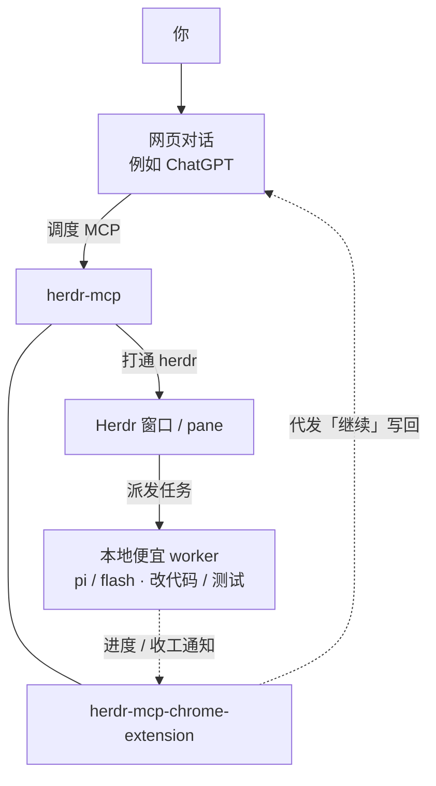

# herdr-mcp

帮助网页版 SOTA 模型打通本机 [herdr](https://herdr.dev)，进入你的开发项目，调度本地 agent 协助开发。

**语言（与 herdr 一致）：** [English](README.md)（GitHub 默认）· [简体中文](README.zh.md) · [日本語](README.ja.md)。  
CLI / 浏览器插件：首次安装跟系统语言（`en` / `zh` / `ja`），未知则英语。可随时改：`herdr-mcp lang`，或插件选项页 → 语言。

## 架构（用户 ↔ 网页 ↔ MCP ↔ herdr，插件做反向通道）

自上而下：你 → 网页对话 →（herdr-mcp 与 chrome-extension **同排**）→ Herdr 窗口 → 本地 Agents。  
Agents 的进度/收工通知到 extension；extension 再 ↻ 代你往网页发「继续」。详见 [docs/extension-wake.md](docs/extension-wake.md)。

**编排偏向（网页规划，本机省 API）：** 网页模型负责计划与调度。能用 `herdr_fs_*` / `herdr_exec` 就不要开本地 agent。必须推理时，直接 `herdr_prompt` 给便宜/高速 worker（pi、flash 等），不要经本机 Claude/OMP/main 再转派。`inspect`/`since` 默认软隐藏 Claude/OMP/Codex（只列 pi/cline/opencode/anti 与 droid/grok）；知道 pane 仍可 prompt。`HERDR_MCP_AGENT_ALLOW=*` 显示全部。



## 平台与启动

支持系统与 [herdr](https://herdr.dev) 一致：**macOS / Linux / Windows**（Node.js 20+）。本服务不扫 herdr 安装目录，只连 API socket（默认 `~/.config/herdr/herdr.sock`，可用 `HERDR_SOCKET_PATH` 覆盖），并调用 PATH 上的 `herdr api schema`。

启动（前台即可）：

```bash
export HERDR_MCP_TOKEN="$(openssl rand -hex 16)"   # 或沿用已有 token
export HERDR_MCP_PORT=8772
# 公网 Connector 时再设（不要带 /mcp）:
# export HERDR_MCP_BASE_URL=https://xxxx.trycloudflare.com
node dist/server.js
```

自启、systemd、任务计划等由你自行决定，不是本项目范围。macOS 上可选软链 `bin/herdr-mcp` 做 `status` / `logs` 等辅助；核心始终是上面的 Node 进程。

## 安装（从零到可用）

### 0. 前置

- 已安装并正在运行 [herdr](https://herdr.dev)
- Node.js 20+（`node -v`）
- 接 ChatGPT 时需要公网 HTTPS：`cloudflared`（[Quick Tunnel](https://developers.cloudflare.com/cloudflare-one/connections/connect-networks/do-more-with-tunnels/trycloudflare/)）或自有域名

### 1. 下载与构建

```bash
git clone https://github.com/whshang/herdr-mcp.git
cd herdr-mcp
npm install
npx tsc
mkdir -p ~/.config/herdr-mcp
```

### 2. 启动本机 MCP

```bash
export HERDR_MCP_TOKEN="$(openssl rand -hex 16)"
echo "token=$HERDR_MCP_TOKEN"   # 留给 Cursor / 浏览器插件
node dist/server.js
# 另开终端自检: curl -s -o /dev/null -w '%{http_code}\n' http://127.0.0.1:8772/
```

### 3. 接到 ChatGPT（推荐：免费 Cloudflare）

另开终端：

```bash
cloudflared tunnel --url http://127.0.0.1:8772
# 记下 https://xxxx.trycloudflare.com
```

用该源站重启 MCP（**不要**带 `/mcp`）：

```bash
export HERDR_MCP_BASE_URL=https://xxxx.trycloudflare.com
export HERDR_MCP_TOKEN=...   # 与上次相同
node dist/server.js
```

#### 在 ChatGPT 网页添加 Connector（客户端聊天里加不了）

MCP 服务**不能**在 ChatGPT 桌面/App 的聊天里添加，只能走**网页版**：

1. 打开 [https://chatgpt.com/#settings/Plugins](https://chatgpt.com/#settings/Plugins)，进入 **Developer mode**，打开开关
2. 打开 [https://chatgpt.com/plugins#settings/Connectors?create-connector=true](https://chatgpt.com/plugins#settings/Connectors?create-connector=true)
3. 填写名称，以及 MCP 地址 `https://xxxx.trycloudflare.com/mcp`（与 `HERDR_MCP_BASE_URL` + `/mcp` 一致）
4. 点击登录，等跳转回来即可（本服务默认是免登陆完成的 OAuth 流程，**不要**填 API key / Token）
5. 配好后**开新对话**（旧对话会持有旧 tool snapshot）

#### 报错或工具没刷出来

若出现：

- `Error fetching OAuth configuration` / `MCP server https://xxx.trycloudflare.com/mcp does not implement OAuth`
- `There was a problem connecting xxx. Try again later.`
- 或添加成功了，但工具没刷出来

先确认本机 `HERDR_MCP_BASE_URL` 与 ChatGPT 填的 HTTPS 源站一致、`cloudflared` 仍在跑、`herdr-mcp status` 公网可达。仍不行就到插件管理里**多手动连接几次**——多数是 ChatGPT 自身缓存或网络问题。更多硬性要求见 [docs/chatgpt-connector.md](docs/chatgpt-connector.md)。

#### 模型额度

免费 ChatGPT 只能用 **GPT-5.5-mini**。Plus 或更高档位可在聊天里近乎无限量地用更高等级模型，经 connector 操作本机项目。

Quick Tunnel 每次重启 `cloudflared` 子域会变，变了就更新 `HERDR_MCP_BASE_URL` 再 `herdr-mcp restart`。稳定主机名可用 Cloudflare 命名隧道或自有域名。

### 6. Cursor（可选，本机）

`~/.cursor/mcp.json` 只挂本地（同一配置里不要再挂公网）：

```json
{
  "mcpServers": {
    "herdr-mcp-local": {
      "url": "http://127.0.0.1:8772/mcp",
      "headers": {
        "Authorization": "Bearer <执行 herdr-mcp token 后粘贴>"
      }
    }
  }
}
```

## 地址速查

| 用途 | URL |
|---|---|
| 本机 MCP | `http://127.0.0.1:8772/mcp` |
| 公网 MCP | `{HERDR_MCP_BASE_URL}/mcp` |
| 浏览器插件推送 | `http://127.0.0.1:8772/push/events` |

Connector 认证走 **OAuth（自动注册）**。静态 Bearer 只给本机 curl / Cursor：`herdr-mcp token`。

## 命令行

```bash
herdr-mcp              # 菜单
herdr-mcp status
herdr-mcp connector
herdr-mcp start | stop | restart
herdr-mcp logs [-f]
herdr-mcp token | url
herdr-mcp lang [en|zh|ja]   # 界面语言（首次跟系统；未知则英语）
herdr-mcp watchdog install  # 每 120s 自检：MCP 挂了才重启；TaskGroup 只记日志
herdr-mcp watchdog status
```

改代码后：`npx tsc && herdr-mcp restart`。

## 默认工具（为什么是这 18 个）

herdr 本体是一大套 Unix socket API（`herdr api schema`，约 90 个方法）。herdr-mcp **不会**把每个方法都做成 MCP 工具（占上下文、也和 herdr 重复），而是三层：

| 层 | MCP 工具 | 和 herdr 的关系 |
|---|---|---|
| 透传 | `herdr_methods`、`herdr_call` | 直接打到 **herdr 原生** socket。先 `herdr_methods` 查 schema，再用 `herdr_call` 调任意方法。 |
| 远程编排 | `herdr_inspect`、`herdr_since`、`herdr_prompt` | 给「只有用户发消息才跑」的网页客户端用的薄封装，基于 snapshot/events/`agent.prompt`，不是另造一套 herdr 能力。 |
| 远程工作站 | `herdr_fs_*`、`herdr_exec`、`herdr_exec_*`、`herdr_git` | **不是** herdr 能力 — 远程客户端本身没有磁盘 |

| 工具 | 做什么 |
|---|---|
| `herdr_skill` | 只读：优先从上游 herdr **master** 拉最新 SKILL.md；网络不可达时用**安装包内置副本**（`assets/herdr-agent-SKILL.md`）。ChatGPT 不访问 GitHub，只有本机 herdr-mcp 进程会拉。`HERDR_SKILL_NETWORK=0` 强制只用内置。 |
| `herdr_methods` | 列出当前 herdr socket 方法与参数 schema（反射缓存）。陌生调用前先查。 |
| `herdr_call` | 用 `{ method, params }` 调任意 herdr 方法（pane / workspace / agent 等），避免「一方法一工具」。 |
| `herdr_inspect` | 一次看清连接 + workspaces / tabs / panes / agents（cwd、状态），以及 `workstation_info`、`boot_id`、`exec_sessions`。通常第一个调用。 |
| `herdr_since` | 按 cursor 增量摘要，续聊时不用整包重拉状态（跨 MCP 重启有 `boot_id` / `cursor_reset`）。 |
| `herdr_prompt` | 经 socket `agent.prompt` 投递（默认 fire-and-forget；强烈建议 `idempotency_key`；状态用 `herdr_since` / `herdr_inspect`）。优先便宜 worker；不要把规划/转派交给本机 Claude/OMP。 |
| `herdr_fs_read` | 读本机 managed git 项目内的文件。 |
| `herdr_fs_list` | 列 managed root 下目录（跳过 `.git` / 疑似密钥名）。 |
| `herdr_fs_grep` | 在 managed root 内搜内容（优先 `rg`）。 |
| `herdr_fs_write` | 新建/覆盖文件（覆盖须 `overwrite:true`；脏文件 / 忙碌闸门）。 |
| `herdr_fs_edit` | 精确唯一字符串替换（闸门同 write）。 |
| `herdr_fs_patch` | coding-tools 风格 `*** Begin Patch` 多文件补丁（`dry_run`）。 |
| `herdr_fs_image` | 读托管根内图片，MCP image 回传。 |
| `herdr_git` | `status` / `diff` / `log` 确定性 git 事实（勿派本地 agent 代劳）。 |
| `herdr_exec` | 短命令：workspace 可见 `herdr-mcp:utility` pane。若控制面 TaskGroup 在 **投递前** 阻断窗格操作，自动降级本机 zsh（`backend:local_fallback`）；已投递后绝不重发。 |
| `herdr_exec_start` / `read` / `kill` | 长命令后台会话（本机进程，非 utility pane）。 |

可选：`HERDR_MCP_ALL_TOOLS=1` 打开高级/废弃生命周期工具。写操作限 managed git root；`HERDR_MCP_READONLY=1` / `HERDR_MCP_WRITE_ROOTS=/a,/b` 可再收紧。

## 浏览器插件

目录 `extension/`（MV3）。`chrome://extensions` 加载未打包扩展。

**两条对等主线**（见 [docs/extension.md](docs/extension.md)）：

1. **进度回推**：网页对话绑到 herdr **workspace**；space 内任意 agent 有新输出/停下来可回推；全部停 working 才收工唤醒；ChatGPT 回合结束后可用小模型判定是否催促继续（扩展 ≥0.1.20；Options 预填提示词/不发送词，继续时提交模型原文）
2. **JSON→MCP**：DeepSeek / z.ai 无 connector 时，助手 JSON → 本机 `/mcp`（路线见 [docs/extension-bridge.md](docs/extension-bridge.md)）

共享本地 `127.0.0.1:8772` 与静态 token。这不是给 DeepSeek「安装」ChatGPT 式 OAuth connector。

## 文档

| 文档 | 内容 |
|---|---|
| [docs/extension.md](docs/extension.md) | 扩展双主线总览（中文） |
| [docs/architecture.md](docs/architecture.md) | herdr 与 MCP 分层 |
| [docs/chatgpt-connector.md](docs/chatgpt-connector.md) | ChatGPT OAuth / 传输 / schema |
| [docs/extension-wake.md](docs/extension-wake.md) | 主线 A：进度回推 |
| [docs/extension-bridge.md](docs/extension-bridge.md) | 主线 B：JSON→MCP |
| [tests/README.md](tests/README.md) | 默认测试 vs 手工脚本 |

过程笔记在 `docs/_wip/`（gitignore，不入库）。

## 运维

```bash
npx tsc          # 改代码后重新编译
# 重启你用来跑 node dist/server.js 的那个进程
```

会话文件：`~/.config/herdr-mcp/sessions/`。
